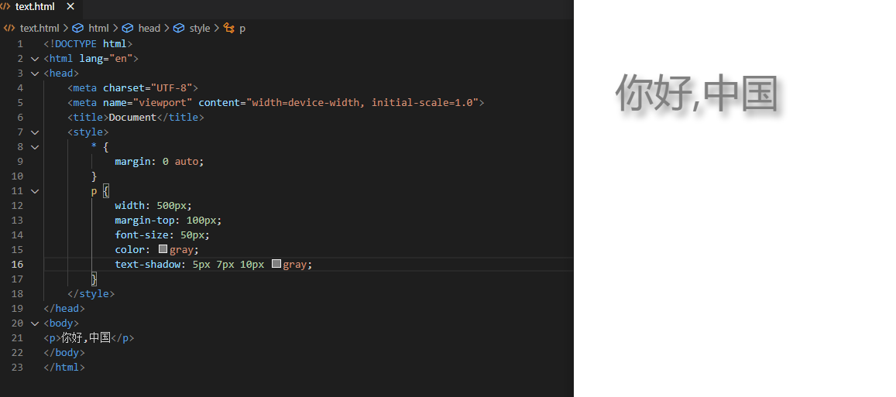
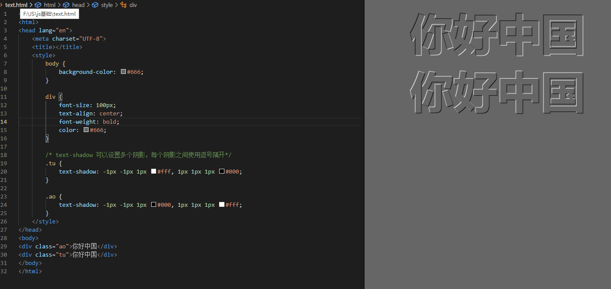

<div align='center' ><font size='70'>CSS3属性</font></div>

-----

## 1.文本属性

**1.文本的阴影text-shadow**

```javascript
text-shadow: 20px 27px 22px pink;
```
参数解释：水平位移 垂直位移 模糊程度 阴影颜色。



**举例：凹凸文字效果**

```css
 /* text-shadow 可以设置多个阴影，每个阴影之间使用逗号隔开*/
        .tu {
            text-shadow: -1px -1px 1px #fff, 1px 1px 1px #000;
        }

```




## 2.box-sizing

CSS3 对盒模型做出了新的定义，即允许开发人员**指定盒子宽度和高度的计算方式**。

```css
    box-sizing：border-box;
```
属性值：
* content-box 标准盒子模型    

此时设置的 width 和 height 是**内容区域**的宽高。`盒子的实际宽度 = 设置的 width + padding + border`。此时改变 padding 和 border 的大小，也不会改变内容的宽高，而是盒子的总宽高发生变化。

* border-box  IE盒模型       

此时设置的 width 和 height 是**盒子**的总宽高。`盒子的实际宽度 = 设置的 width`。此时改变 padding 和 border 的大小，会改变内容的宽高，盒子的总宽高不变。

## 3.私有前缀

处理兼容性问题的常见方法：为属性添加**私有前缀**。

```
    -webkit-: 谷歌 苹果
    -moz-:火狐
    -ms-：IE
    -o-：欧朋
```

**举例**

```javascript
    background: -webkit-linear-gradient(left, green, yellow);
    background: -moz-linear-gradient(left, green, yellow);
    background: -ms-linear-gradient(left, green, yellow);
    background: -o-linear-gradient(left, green, yellow);
    background: linear-gradient(left, green, yellow);
```

## 4.边框属性

**1.边框圆角border-radius**

```javascript
border-radius: 60px 120px;        //参数解释：水平半径   垂直半径
border-radius: 20px 60px 100px 140px;  //从左上开始，顺时针赋值。如果当前角没有值，取对角的值
border-radius: 60px;  // 缩写
```

**2.边框阴影box-shadow**

```javascript
box-shadow: 水平偏移 垂直偏移 模糊程度 阴影大小 阴影颜色;

box-shadow: 15px 21px 48px -2px #666;
```
参数解释：

- 水平偏移：正值向右 负值向左。
- 垂直偏移：正值向下 负值向上。
- 模糊程度：不能为负值。

后面还可以再加一个inset属性，表示内阴影。如果不写，则默认表示外阴影。

```javascript
box-shadow:3px 3px 3px 3px #666 inset;
```

**3.边框图片(不常用)**

```javascript
	/* 边框图片的路径*/
	border-image-source: url("images/border.png");

	/* 图片边框的裁剪*/
	border-image-slice: 27;

	/*图片边框的宽度*/
	border-image-width: 27px;

	/*边框图片的平铺*/
	/* repeat :正常平铺 但是可能会显示不完整*/
	/*round: 平铺 但是保证 图片完整*/
	/*stretch: 拉伸显示*/
	border-image-repeat: stretch;
```