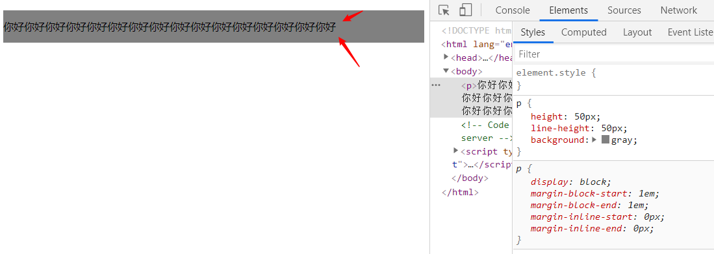

<div align='center' ><font size='70'>字体font</font></div>

-----

```css
p{
	font-size: 50px; 		/*字体大小*/
	line-height: 30px;      /*行高*/
	font-family: 幼圆,黑体; 	/*字体类型：如果没有幼圆就显示黑体，没有黑体就显示默认*/
	font-style: italic ;		/*italic表示斜体，normal表示不倾斜*/
	font-weight: bold;	/*粗体*/
	font-variant: small-caps;  /*小写变大写*/
}
```
**特别简单的不详细举例了**

## 1.line-height

**CSS中，所有的行，都有行高。盒子模型的padding，绝对不是直接作用在文字上的，而是作用在“行”上的。**

* 如何让单行文本垂直居中?

方式一：
```css
p {
    height: 50px;
    line-height: 50px; /**行高 = 盒子高*/
    background: gray;
}
```


方式二： 

`vertical-align`属性可用于指定**行内元素**（inline）、**行内块元素**（inline-block）、**表格的单元格**（table-cell）的垂直对齐方式。主要是用于图片、表格、文本的对齐。

```css
vertical-align: middle; /*指定行级元素的垂直对齐方式。*
```
## 2.文本属性

CSS样式中，常见的文本属性有以下几种：

- `letter-spacing: 0.5cm ;`  单个字母之间的间距
- `word-spacing: 1cm;`   单词之间的间距
- `text-decoration: none;` 字体修饰：none 去掉下划线、**underline 下划线**、line-through 中划线、overline 上划线
- `text-transform: lowercase;`  单词字体大小写。uppercase大写、lowercase小写
- `color:red;` 字体颜色
- `text-align: center;` 在当前容器中的对齐方式。属性值可以是：left、right、center、justify
- `text-transform: lowercase;` 单词的字体大小写。属性值可以是：`uppercase`（单词大写）、`lowercase`（单词小写）、`capitalize`（每个单词的首字母大写）