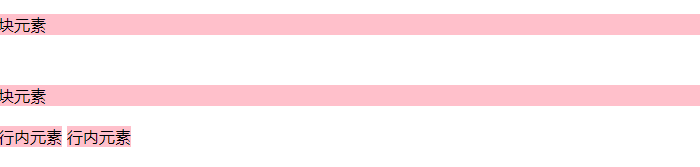

<div align='center' ><font size='70'>文档流</font></div>

----------

## 1.什么是文档流

**文档流指的是元素排版布局过程中，元素会默认自动从左往右，从上往下的流式排列方式。并最终窗体自上而下分成一行行，并在每行中从左至右的顺序排放元素。**

## 2.文档流特性

* 1.空白折叠

无论多少个空格、换行、tab，都会折叠为一个空格。

```html
<!--如果我们想让img标签之间没有空隙，必须紧密连接-->

```

* 2.高矮不齐，底边对齐
```html
   <style>
        .child {
            font-size: 32px;
        }
        img {
            width: 100px;
            height: 300px;
        }

    </style>
<body>
    <div>
        <span>你好哈哈哈哈哈</span>
        <span class="child">不错</span>
        
    </div>
</body>
```


* 3. 自动换行，一行写不满，换行写

无视换行

## 3.行内元素和块元素

* 行内元素
* 块级元素

**行内元素：**
```
a span b  i em ....
```

- 与其他行内元素并排；
- 不能设置宽、高。默认的宽度，就是文字的宽度

**块级元素：**

```
div p dt dd ul li  h1 h2 .....
```

- 霸占一行，不能与其他任何元素并列；
- 能接受宽、高。如果不设置宽度，那么宽度将默认变为父亲的100%。



**### 行内元素和块级元素的相互转换**

```
// 块转行  比如div    此时这个div不能设置宽度、高度；
display: inline;
```

```
// 行转块   比如 span   此时这个span能够设置宽度、高度、独占一行
display: block;
```

```
// 行内块
display：inline-block;
```