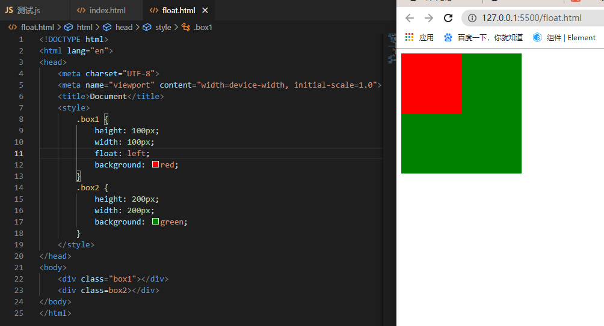
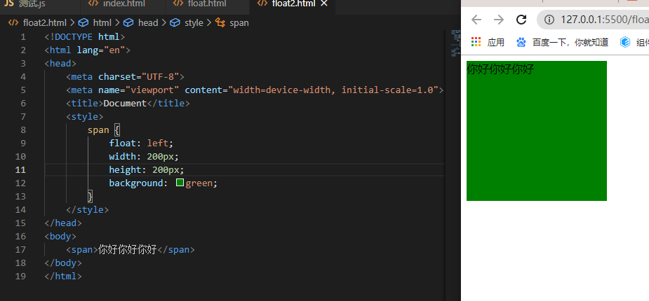
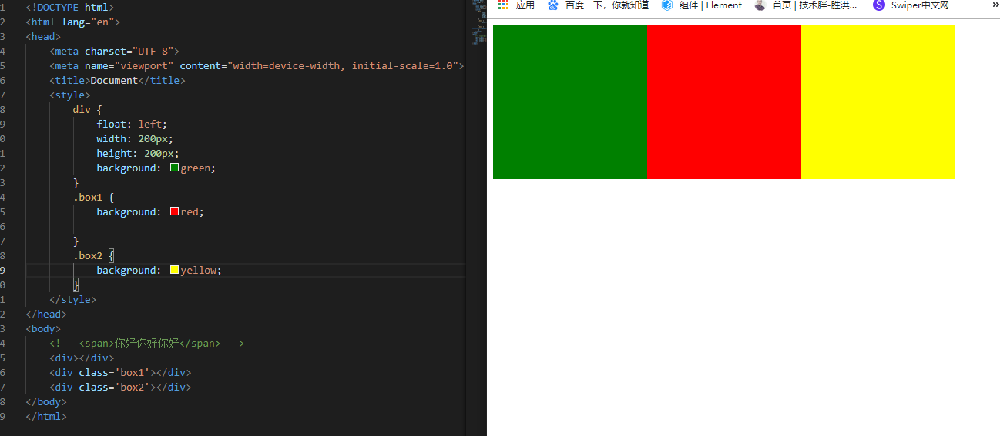
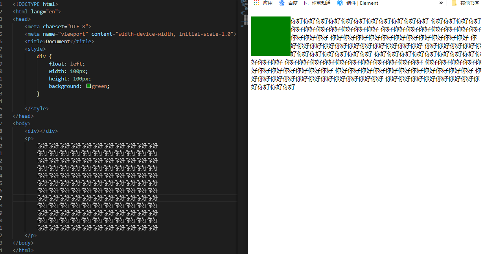
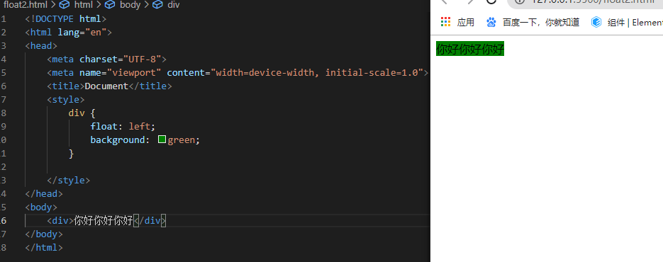

<div align='center' ><font size='70'>浮动-float</font></div>

**脱离文档流的三种手段：**
- （1）浮动
- （2）绝对定位
- （3）固定定位

## 1.浮动元素脱标
**实例1**



在默认情况下，两个div标签是上下进行排列的。现在由于float属性让上图中的第一个`<div>`标签出现了浮动，于是这个标签在另外一个层面上进行排列。而第二个`<div>`还在自己的层面上遵从标准流进行排列。

**实例2**



**说明：**

span标签在标准流中，是不能设置宽高的（因为是行内元素）。但是，一旦设置为浮动之后，即使不转成块级元素，也能够设置宽高了。

**总结：一旦一个元素浮动了，那么，将能够并排了，并且能够设置宽高了。无论它原来是个div还是个span。所有标签，浮动之后，已经不区分行内、块级了。也就意味着脱离文档流了**

## 2.浮动的元素互相贴靠



**说明：**

**缩放浏览器的大小，三个盒子仍然相互贴靠，自动适应。**


## 3.文字环绕效果



**说明：**

**div挡住了p，但不会挡住p中的文字，形成“字围”效果。**

总结：**标准流中的文字不会被浮动的盒子遮挡住**。


## 4.收缩特性

* 收缩：一个浮动的元素，如果没有设置width，那么将自动收缩为内容的宽度（非常像行内元素）。



**说明：**

**上图中，div本身是块级元素，如果不设置width，它会单独霸占整行；但是，设置div浮动后，它会收缩**


## 清除浮动

清除浮动指的是清除浮动与浮动之间的影响。

### 1. 给祖先元素添加高度(扩展性不好)


### 2.after伪元素(推荐)

```
clear：both;
```

```html
<style>
   .clearfix:after{/*伪元素是行内元素 正常浏览器清除浮动方法*/
        content: "";
        display: block;
        height: 0;
        clear:both;
        visibility: hidden;
    }
    .clearfix{
        *zoom: 1;/*ie6清除浮动的方式 *号只有IE6-IE7执行，其他浏览器不执行*/
    }
</style>
<body>
    <div class="fahter clearfix">
        <div class="big">big</div>
        <div class="small">small</div>
        <!--<div class="clear">额外标签法</div>-->
    </div>
    <div class="footer"></div>
</body>
```

**使用before和after双伪元素清除浮动**
```html
     .clearfix:after,.clearfix:before{
        content: "";
        display: table;
    }
    .clearfix:after{
        clear: both;
    }
    .clearfix{
        *zoom: 1;
    }
 
 <div class="fahter clearfix">
        <div class="big">big</div>
        <div class="small">small</div>
    </div>
    <div class="footer"></div>
```

### 3.overflow:hidden

触发 BFC

```css
 .fahter{
        width: 400px;
        border: 1px solid deeppink;
        overflow: hidden;
 }
```
### 4.额外标签（不常用）

```html
    <style>
    .fahter{
        width: 400px;
        border: 1px solid deeppink;
    }
    .big{
        width: 200px;
        height: 200px;
        background: darkorange;
        float: left;
    }
    .small{
        width: 120px;
        height: 120px;
        background: darkmagenta;
        float: left;
    }
    .footer{
        width: 900px;
        height: 100px;
        background: darkslateblue;
    }
    .clear{
        clear:both;
    }
    </style>
<body>
    <div class="fahter">
        <div class="big">big</div>
        <div class="small">small</div>
        <div class="clear">额外标签法</div>
    </div>
    <div class="footer"></div>
</body>
```