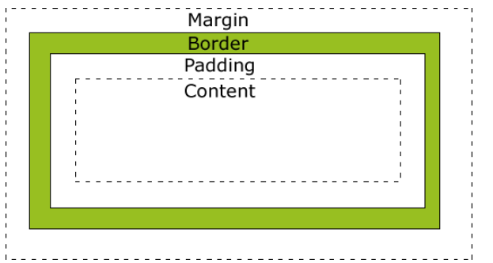

盒模型

-----

**1.什么是盒模型**

所有HTML元素可以看作盒子，在CSS中，"box model"这一术语是用来设计和布局时使用。

CSS盒模型本质上是一个盒子，封装周围的HTML元素，它包括：边距，边框，填充，和实际内容。

盒模型允许我们在其它元素和周围元素边框之间的空间放置元素。

一个盒子中主要的属性就5个：width、height、padding、border、margin。如下：

- width和height：**内容**的宽度、高度（不是盒子的宽度、高度）。
- padding：内边距。
- border：边框。
- margin：外边距。

**2.标准盒模型和IE盒模型**

CSS盒模型和IE盒模型的区别：

- 在**标准盒子模型**中，**width 和 height 指的是内容区域**的宽度和高度。增加内边距、边框和外边距不会影响内容区域的尺寸，但是会增加元素框的总尺寸。
- **IE盒子模型**中，**width 和 height 指的是内容区域+border+padding**的宽度和高度。