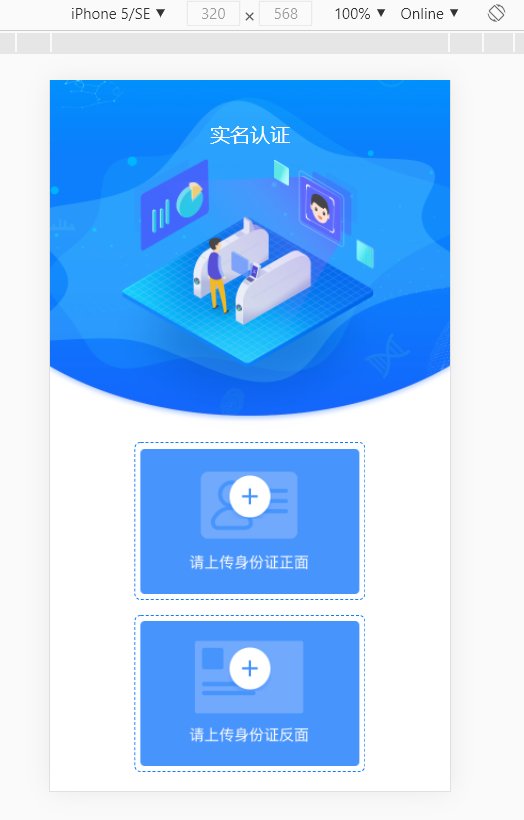
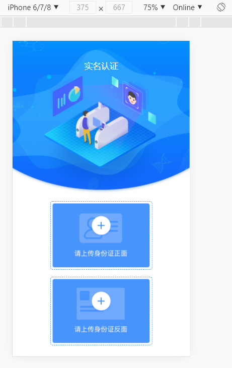
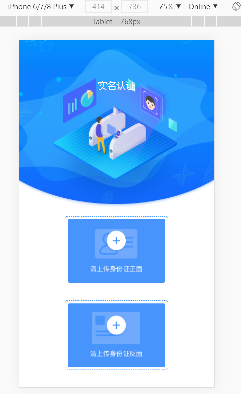

<div align='center' ><font size='70'>移动端适配方案</font></div>

-------------

## 1.使用媒体查询

* `@media screen and (条件) {    }`

**分析：**
1. 通过媒体查询
    
    它主要是通过查询设备的宽度来执行不同的css代码，最终达到界面的适配。

2. 媒体查询优势
    * 简单, 哪里不对改哪里。
    * 调整屏幕宽度的时候不用刷新页面即可响应式展示。
    * 特别适合对移动端和PC维护同一套代码的时候。

3. 媒体查询劣势
    * 由于移动端和PC端维护同一套代码, 所以代码量比较大，维护不方便。
    * 为了兼顾大屏幕或高清设备，会造成其他设备资源浪费，特别是加载图片资源。

4. 应用场景
    * 对于比较简单(界面不复杂)的网页,可以考虑。 
    * 对于比较复杂(界面复杂)的网页, 则没有使用的必要。





[github案例代码](https://github.com/cht-w/Mobile-terminal-adaptation)

## 2.两套代码

  很多比较复杂的商城类不适合使用媒体查询进行适配。他们更倾向于去 开发两套代码。例如: 淘宝，京东等。

    * 在PC端打开展示PC端页面
    * 在移动端打开展示移动端页面

    可以通过BOM的navigator对象中的userAgnet来获取代理头信息。

    封装一个方法用于判断打开移动端还是pc端页面，即可完成适配。


```js
    // 返回用户代理头的字符串表示(就是包括浏览器版本信息等的字符串)
    let navigatorInfo = window.navigator.userAgent;
    console.log(navigatorInfo);
```

* PC端： Mozilla/5.0 (Windows NT 10.0; Win64; x64) AppleWebKit/537.36 (KHTML, like Gecko) Chrome/87.0.4280.88 Safari/537.36
* iphone： Mozilla/5.0 (`iPhone`; CPU iPhone OS 13_2_3 like Mac OS X) AppleWebKit/605.1.15 (KHTML, like Gecko) Version/13.0.3 Mobile/15E148 Safari/604.1

* Android: Mozilla/5.0 (Linux; `Android` 8.0; Pixel 2 Build/OPD3.170816.012) AppleWebKit/537.36 (KHTML, like Gecko) Chrome/87.0.4280.88 Mobile Safari/537.36


```js
// 封装一个判断
function isPC() {
        let navigatorInfo = window.navigator.userAgent;

        if(/iphone/i.test(navigatorInfo)) {
            return false;
        }else if(/android/i.test(navigatorInfo)) {
            return false;
        }else {
            return true;
        }
    }
if(!isPC()) {
    location.href='http://m.jd.com';
}

```

## 3.媒体查询+rem适配

方案二将PC端和移动端的代码分开，但是市场上的手机种类和尺寸大小太多了，移动端适配也是有必要的。

使用 媒体查询来适配手机的尺寸大小，结合rem特性，也可以达到适配效果。

1. 如何等比缩放?
    * 将设计图片等分为指定份数,求出每一份的大小
        例如: 750设计图片分为7.5份, 那么每一份的大小就是100px
    * 将目标屏幕也等分为指定份数,求出每一份的大小
       例如: 375屏幕也分为7.5份, 那么每一份的大小就是50px

    * 用 原始元素尺寸 / 原始图片每一份大小 * 目标屏幕每一份大小 = 等比缩放后的尺寸
       例如: 设计图片上有一个150，150的图片, 我想等比缩放显示到375屏幕上
       那么: 150 / 100 * 50 = 1.5*50 = 75px

2. 开发中使用计算公式?

    * 目标屏幕每一份的大小就是html的font-size: 50px
    * 使用时只需要用 "原始元素尺寸 / 原始图片每一份大小rem" 即可

        150 / 100 = 1.5 / 1.5rem

        1rem = 50px  / 1.5rem === 1.5*50 = 75px

3. 网站分析

    * 网易新闻
        ```
        750/100=7.5;

        375/7.5=50;

        320/7.5=42.7;
        ```
    * 苏宁易购
        ```
        750/50=15;

        375/15=25;

        320/15=21.33
        ```
**操作: 结合less 我们可以简化运算操作**

```css
    <style type="text/less">
      *{
        margin: 0;
        padding: 0;
      }
      // iphone5:
      @media screen and (max-width: 320px){
        /*
        750 / 7.5 = 100
        320 / 7.5 = 42.67
        */
        html{
          font-size: 42.67px;
        }
      }
      // iphone678:
      @media screen and (min-width: 375px){
        /*
        750 / 7.5 = 100
        375 / 7.5 = 50
        */
        html{
          font-size: 50px;
        }
      }
      // iphone678Plus:
      @media screen and (min-width: 414px){
        /*
        750 / 7.5 = 100
        414 / 7.5 = 55.2
        */
        html{
          font-size: 55.2px;
        }
      }
      .top{
        position: relative;
      }
      .top>img{
        width: 100%;
        height: auto;
      }
      .top>p{
        position: absolute;
        left: 50%;
        transform: translateX(-50%);
        top: 80/100rem;
        font-size: 36/100rem;
        color: #fff;
      }
      .middle, .bottom{
        position: relative;
        height: 290/100rem;
      }
      .main{
        border: 1px dashed #0d7efb;
        border-radius: 5/100rem;
        padding: 10/100rem;
        display: inline-block;
        position: absolute;
        left: 50%;
        transform: translateX(-50%);
      }
      .main>img:nth-of-type(1){
        width: 410/100rem;
        height: 270/100rem;
        vertical-align: bottom;
      }
      .main>img:nth-of-type(2){
        width: 84/100rem;
        height: 84/100rem;
        vertical-align: bottom;
        position: absolute;
        left: 50%;
        transform: translateX(-50%);
        top: 60/100rem;
      }
      .bottom{
        margin-top: 35/100rem;
      }

    </style>
    <script src="js/less.js"></script>
```

[github案例代码](https://github.com/cht-w/Mobile-terminal-adaptation)


## 4.使用js代码设置根元素

```js
    document.documentElement // html根元素
    document.documentElement.style.fontSize = window.innerWidth/ 7.5 + 'px';  
```

通过 JS 动态计算当前屏幕的每一份的大小可以让我们不写媒体查询(有时候写媒体查询的判断可能有几十种)

缺点：

* 切换屏幕后需要手动刷新才可生效。
* 媒体查询切换屏幕后自动响应，不需要刷新。
