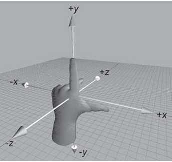

<div align='center' ><font size='70'>转换transform</font></div>

------


## 1.2D转换

**转换** 可以实现元素的**位移、旋转、变形、缩放**

**1.缩放scale**

```javascript
transform: scale(x, y);

transform: scale(2, 0.5);
```

参数解释： 

- x：表示水平方向的缩放倍数。
- y：表示垂直方向的缩放倍数。如果只写一个值就是等比例缩放。
- 取值：大于1表示放大，小于1表示缩小。不能为百分比。

**举例**
```html
    <style>
        .box {
            width: 1000px;
            margin: 100px auto;
        }

        .box div {
            width: 300px;
            height: 150px;
            background-color: pink;
            float: left;
            margin-right: 15px;
            color: white;
            text-align: center;
            font: 400 30px/150px “宋体”;

        }

        .box .box2 {
            background-color: green;
            transition: all 1s;
        }

        .box .box2:hover {
            /*width: 500px;*/
            /*height: 400px;*/
            background-color: yellowgreen;

            /* transform:  css3中用于做变换的属性
                scale(x,y)：缩放 */
            transform: scale(2, 0.5);
        }

    </style>
<body>
<div class="box">
    <div class="box1">1</div>
    <div class="box2">2</div>
    <div class="box3">3</div>
</div>
</body>
```

**2.位移translate**

```javascript
transform: translate(水平位移, 垂直位移);

transform: translate(-50%, -50%)
```

参数解释：

- 参数为百分比，相对于自身移动。
- 正值：向右和向下。 负值：向左和向上。如果只写一个值，则表示水平移动。

**举例：**
```html
    <style>
        .box {
            width: 1000px;
            margin: 100px auto;
        }

        .box > div {
            width: 300px;
            height: 150px;
            border: 1px solid #000;
            background-color: red;
            float: left;
            margin-right: 30px;
        }

        div:nth-child(2) {
            background-color: pink;
            transition: all 1s;
        }

        /* translate:(水平位移，垂直位移)*/
        div:nth-child(2):hover {
            transform: translate(-50%, -50%);
        }
    </style>
<body>
<div class="box">
    <div class="box1">1</div>
    <div class="box2">2</div>
    <div class="box3">3</div>
</div>
</body>
```

**应用：让绝对定位中的盒子在父容器中居中**

水平垂直居中类似

```css
div {
	    width: 600px;
	    height: 60px;
	    background-color: red;
	    position: absolute;       绝对定位的盒子
	    left: 50%;               首先，让左边线居中
	    top: 0;
	    transform: translate(-50%);    然后，利用translate，往左走自己宽度的一半【推荐写法】
	}
```
**3.旋转rotate**

```javascript
transform:rotate(角度);

transform: rotate(45deg);
```

参数解释：正值 顺时针；负值：逆时针。

**旋转需要给旋转的元素一个过渡效果，不然会直接到达旋转后的位置，没有旋转中过程的感觉**
```html
    <style>
        .box {
            width: 200px;
            height: 200px;
            background-color: red;
            margin: 50px auto;
            color: #fff;
            font-size: 50px;
            transition: all 2s; /* 过渡：让盒子在进行 transform 转换的时候，有个过渡期 */
        }
        /* rotate（角度）旋转 */
        .box:hover {
            transform: rotate(-405deg); /* 鼠标悬停时，让盒子进行旋转 */
        }
    </style>
</head>
<body>
<div class="box">1</div>
</div>
</body>
```

rotate 旋转时，默认是以盒子的正中心为坐标原点的。如果想**改变旋转的坐标原点**，可以用`transform-origin`属性。

```javascript
transform-origin: 水平坐标 垂直坐标;

transform-origin: 50px 50px;

transform-origin: center bottom;   //旋转时，以盒子底部的中心为坐标原点
```

## 2.3D转换

**1.旋转rotate**

`rotateX`  `rotateY`  `rotateZ` 

**3D坐标系（左手系）**



```javascript
	transform: rotateX(360deg);    //绕 X 轴旋转360度

	transform: rotateY(360deg);    //绕 Y 轴旋转360度

	transform: rotateZ(360deg);    //绕 Z 轴旋转360度
```

**rotateX举例**

```html
    <style>
        .rotateX {
            width: 300px;
            height: 226px;
            margin: 200px auto;

            /* 透视 :加给变换的父盒子*/
            /* 设置的是用户的眼睛距离 平面的距离*/
            /* 透视效果只是视觉上的呈现，并不是正真的3d*/
            perspective: 110px;
        }

        img {
            /* 过渡*/
            transition: transform 2s;
        }

        /* 所有的3d旋转，对着正方向去看，都是顺时针旋转*/
        .rotateX:hover img {
            transform: rotateX(360deg);
        }

    </style>
<body>
<div class="rotateX">
    
</div>
</body>
```

**2.移动translate**

`translateX`  `translateY`  `translateZ` 

```javascript
	transform: translateX(100px);    //沿着 X 轴移动

	transform: translateY(360px);    //沿着 Y 轴移动

	transform: translateZ(360px);    //沿着 Z 轴移动
```

**translateX**

```html
    <style>
        .box {
            width: 200px;
            height: 200px;
            background: green;
            transition: all 1s;
        }
        .box:hover {
            transform: translateX(100px);
        }
    </style>
</head>
<body>
<div class="box"></div>
</body>

```

## 3.透视perspective

透视可以将一个2D平面，在转换的过程当中，呈现3D效果。但仅仅只是视觉呈现出 3d 效果，并不是正真的3d。

格式有两种写法：

- 作为一个属性，设置给父元素，作用于所有3D转换的子元素
- 作为 transform 属性的一个值，做用于元素自身。
     
```javascript
perspective: 500px;
```