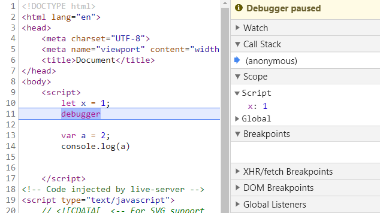

<div align='center' ><font size='70'>let 与 const (常用)</font></div>

-----

**1.let,const用于声明变量** , 与var不同的是，let/const会创建一个块级作用域（通俗讲就是一个花括号内是一个新的作用域）

```javascript
{
    let x = 100;
}
{
    let x = 10;
}
console.log(x); // 报错
```
**注意的是使用let/const关键字声明变量的for循环和var声明的有些不同**

```javascript
for(var i=0 ; i< 10 ; i++) {
    // something
}
console.log(i); // 10
```
**解释：**

for循环分为3部分，第一部分包含一个变量声明，第二部分包含一个循环的退出条件，第三部分包含每次循环最后要执行的表达式，
也就是说第一部分在这个`for` 循环中只会执行一次 `var i = 0`，而后面的两个部分在每次循环的时候都会执行一遍

```javascript
for(let i = 0 ; i< 10 ; i++) {
    // something
}
console.log(i) // 报错
```

而使用使用let/const关键字声明变量的for循环，除了会创建块级作用域，let/const还会将它绑定到每个循环中，确保对上个循环结束时候的值进行重新赋值
简而言之就是每次循环都会声明一次（对比var声明的for循环只会声明一次），可以这么理解let/const中的for循环。

```javascript
{
    let i = 0;
}
{
    let i = 1;
}
{
    let i = 2;
}
...
```

**2.存在暂时性死区**

使用let/const声明的变量，从一开始就形成了封闭作用域，在声明变量之前是无法使用这个变量的，这个特点也是为了弥补var的缺陷（var声明的变量有变量提升）

```javascript
if(true) {
     age = 10; // 报错
    let age;
})
```

>>由let/const声明的变量，当它们包含的词法环境(Lexical Environment)被实例化时会被创建，但只有在变量的词法绑定(LexicalBinding)已经被求值运算后，才能够被访问。


**3.使用const关键字声明一个常量，常量的意思是不会改变的变量，const和let的一些区别是：**

* const声明变量的时候必须赋值，否则会报错，同样使用const声明的变量被修改了也会报错

```js
    const x; //报错
```

* const声明变量不能改变，如果声明的是一个引用类型，则不能改变它的内存地址。

```js
const obj = { a: 1 };
obj.a = 2;
obj = { c :2 }; //报错 
```

* 在没有显式的声明块级作用域情况下，let/const声明的变量不会变为全局变量。

ES6规定它们不属于顶层全局变量的属性，也就不会污染全局变量。




上图可以看到使用let声明的变量x是在一个叫script作用域下的，而var声明的变量因为变量提升所以提升到了全局变量window对象中，所以不用担心污染全局的window对象。