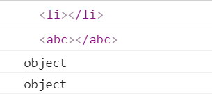
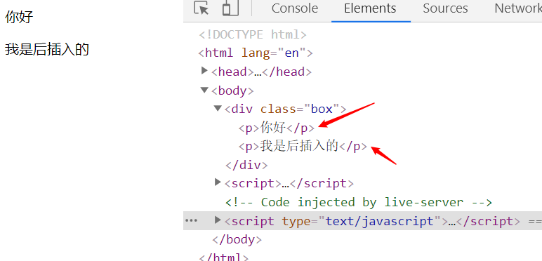
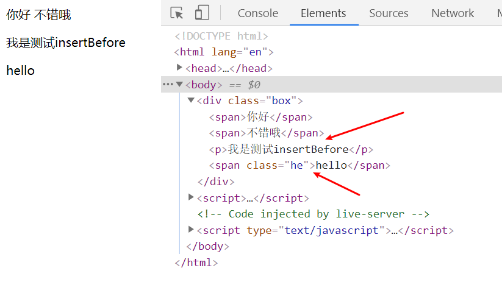

<div align='center' ><font size='70'>节点操作</font></div>

------

## DOM节点的操作

DOM操作最常用的方法，增删改等。

### 1.创建节点

```
新的标签(元素节点) = document.createElement("标签名");
```
```javascript
    // 创建一个 li 或者 adb标签
    var a1 = document.createElement("li");   //创建一个li标签
    var a2 = document.createElement("abc");   //创建一个不存在的标签

    console.log(a1);
    console.log(a2);

    console.log(typeof a1);
    console.log(typeof a2);
```


### 2.插入节点
**1.appendChild**
* 父节点的最后插入一个新的子节点
```
父节点.appendChild(新的子节点);
```
```html
  <div class="box">
            <p>你好</p>
    </div>
    <script>
        var oBox = document.querySelector('.box');
        var op = document.createElement('p');
        op.innerText="我是后插入的"
        oBox.appendChild(op);
    </script>
```


**2.insertBefore**

* 在参考节点前插入一个新的节点。
* 如果参考节点为null，那么他将在父节点里面的最后插入一个子节点。
```
父节点.insertBefore(新的子节点,作为参考的子节点)
```
```html
    <div class="box">
            <span>你好</span>
            <span>不错哦</span>
            <span class='he'>hello</span>
    </div>
    <script>
        var oBox = document.querySelector('.box');  // 获取父
        var oSpan = document.querySelector('.he');  // 获取参照
        var op = document.createElement('p');  
        op.innerText = "我是测试insertBefore"
        oBox.insertBefore(op , oSpan);
    </script>
```


### 3.删除节点
* **用父节点删除子节点**。必须要指定是删除哪个子节点。
```
父节点.removeChild(子节点);
```

### 4.复制节点(clone)

* 不带参数/带参数false：只复制节点本身，不复制子节点。
* 带参数true：既复制节点本身，也复制其所有的子节点。
```
要复制的节点.cloneNode();  // 不带参数时候默认是false
要复制的节点.cloneNode(true);
``` 

## 设置节点的属性

我们可以获取节点的属性值、设置节点的属性值、删除节点的属性。

### 1.获取节点的属性值

**方式一**
```
元素节点.属性名;
元素节点["属性名"];
```
```html


<script type="text/javascript">
    var myNode = document.getElementsByTagName("img")[0];

    console.log(myNode.src);
    console.log(myNode.className);    //注意，是className，不是class
    console.log(myNode.title);

    console.log("------------");

    console.log(myNode["src"]);
    console.log(myNode["className"]); //注意，是className，不是class
    console.log(myNode["title"]);
</script>
```
**方式二**

```
元素节点.getAttribute("属性名称");
```
```javascript
console.log(myNode.getAttribute("src"));
console.log(myNode.getAttribute("class"));   //注意是class，不是className
console.log(myNode.getAttribute("title"));
```

### 2.设置节点的属性值

**方式一**
```javascript
myNode.src = "images/2.jpg"   //修改src的属性值
myNode.className = "image2-box";  //修改class的name
```

**方式二**
```
元素节点.setAttribute("属性名", "新的属性值");
```
```javascript
myNode.setAttribute("src","images/3.jpg");
myNode.setAttribute("class","image3-box");
myNode.setAttribute("id","你好");
```
### 3.删除节点的属性

```
元素节点.removeAttribute(属性名);
```
```javascript
myNode.removeAttribute("class");
myNode.removeAttribute("id");
```