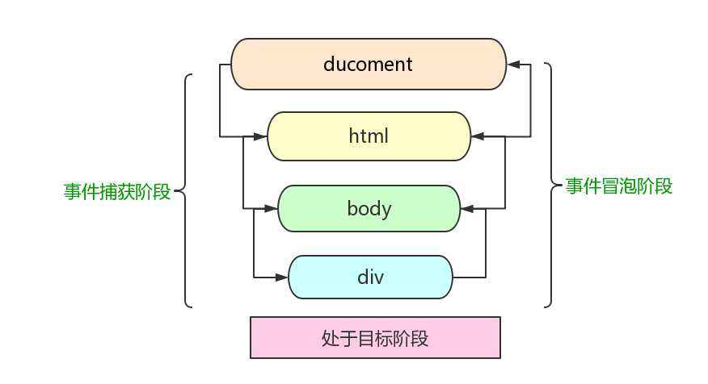

<div align='center' ><font size='70'>事件传播与冒泡</font></div>

------


**事件传播的三个阶段是：事件捕获、事件冒泡和目标。**

- 事件捕获阶段：事件从祖先元素往子元素查找（DOM树结构），直到捕获到事件目标 target。在这个过程中，默认情况下，事件相应的监听函数是不会被触发的。

- 事件目标：当到达目标元素之后，执行目标元素该事件相应的处理函数。如果没有绑定监听函数，那就不执行。

- 事件冒泡阶段：事件从事件目标 target 开始，从子元素往冒泡祖先元素冒泡，直到页面的最上一级标签。





## 1.事件捕获

addEventListener可以捕获事件

```javascript
  box1.addEventListener("click", function () {
        alert("捕获 box3");
    }, true);
```

上面的方法中，参数为true，代表事件在捕获阶段执行。

**举例**

```javascript
    //参数为true，代表事件在「捕获」阶段触发；参数为false或者不写参数，代表事件在「冒泡」阶段触发
    box3.addEventListener("click", function () {
        alert("捕获 child");
    }, true);

    box2.addEventListener("click", function () {
        alert("捕获 father");
    }, true);

    box1.addEventListener("click", function () {
        alert("捕获 grandfather");
    }, true);

    document.addEventListener("click", function () {
        alert("捕获 body");
    }, true
```

**重点**：捕获阶段，事件依次传递的顺序是：window --> document --> html--> body --> 父元素、子元素、目标元素。

```javascript
    window.addEventListener("click", function () {
        alert("捕获 window");
    }, true);

    document.addEventListener("click", function () {
        alert("捕获 document");
    }, true);

    document.documentElement.addEventListener("click", function () {
        alert("捕获 html");
    }, true);

    document.body.addEventListener("click", function () {
        alert("捕获 body");
    }, true);

    fatherBox.addEventListener("click", function () {
        alert("捕获 father");
    }, true);

    childBox.addEventListener("click", function () {
        alert("捕获 child");
    }, true);

```

**说明：**

（1）第一个接收到事件的对象是 **window**。

（2）JS中涉及到DOM对象时，有两个对象最常用：window、doucument。它们俩是最先获取到事件的。

**在js中：**

- 如果想获取 `html`节点，方法是`document.documentElement`。

- 如果想获取 `body` 节点，方法是：`document.body`。

## 2.事件冒泡

**事件冒泡**: 当一个元素上的事件被触发的时候（比如说鼠标点击了一个按钮），同样的事件将会在那个元素的所有**祖先元素**中被触发。这一过程被称为事件冒泡；这个事件从原始元素开始一直冒泡到DOM树的最上层。

通俗来讲，冒泡指的是：**子元素的事件被触发时，父元素的同样的事件也会被触发**。取消冒泡就是取消这种机制。

**举例：**

```javascript
  //事件冒泡
    box3.onclick = function () {
        alert("child");
    }

    box2.onclick = function () {
        alert("father");
    }

    box1.onclick = function () {
        alert("grandfather");
    }

    document.onclick = function () {
        alert("body");
    }
```

一般的浏览器: （除IE6.0之外的浏览器）

- div -> body -> html -> document -> window

IE6.0：

- div -> body -> html -> document

## 3.部分不能冒泡

以下事件不冒泡：blur、focus、load、unload、onmouseenter、onmouseleave。意思是，事件不会往父元素那里传递。

我们检查一个元素是否会冒泡，可以通过事件的以下参数:

```javascript
event.bubbles  // 如果返回值为true，说明该事件会冒泡；反之则相反。
```

**举例：**

```javascript
    box1.onclick = function (event) {
        alert("冒泡 child");

        event = event || window.event;
        console.log(event.bubbles); //打印结果：true。说明 onclick 事件是可以冒泡的
    }
```

## 4.组织冒泡

w3c的方法：（火狐、谷歌、IE11）:
```javascript
 event.stopPropagation();
```

IE10以下则是：

```javascript
event.cancelBubble = true
```

**兼容写法**

```javascript
   box.onclick = function(event) {
           event = event || window.event;
           if(event && event.stopPropagation) {
               event.stopPropagation();
           }else {
               event.cancelBubble = true;
           }
       }
```