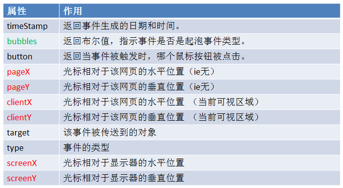

<div align='center' ><font size='70'>事件级别</font></div>

------

## 1.DOM 零级事件

以最典型的onclick说明:

```javascript
element.onclick = function () {
    ...
}
```
```javascript
    var btn = document.getElementsByTagName("button")[0];

    //这种事件绑定的方式，如果绑定多个，则后面的会覆盖掉前面的
    btn.onclick = function () {
        console.log("点击事件1");
    }
    // 直接覆盖上一个事件
    btn.onclick = function () {
        console.log("点击事件2");
    }
```
* **DOM零级事件会发生覆盖，下面覆盖上面**

## 2.DOM二级事件

**addEventListener**

只支持高级浏览器 IE8以上。

```javascript
element.addEventListener('click', function () {
    ...
}, false);
```
**参数说明**
* 参数1：事件名的字符串(注意，没有on)
* 参数2：回调函数：当事件触发时，该函数会被执行
* 参数3：**true表示捕获阶段触发，false表示冒泡阶段触发（默认）**。如果不写，则默认为false。【重要】

```javascript
    btn.addEventListener("click",fn1);
    btn.addEventListener("click",fn2);
    function fn1() { console.log('点击事件1'));
    function fn2() { console.log('点击事件2'));
```
**结论：**
* 一个元素的一个事件，可以绑定多个响应函数。不存在响应函数被覆盖的情况。

**执行顺序是**：事件被触发时，响应函数会按照函数的绑定顺序执行。

* addEventListener()中的this，是绑定事件的对象。


**attachEvent**

IE8及一下

```javascript
    element.attachEvent('onclick', function () {
        ...
    });
```
**参数说明：**
* 参数1：事件名的字符串(注意，有on)
* 参数2：回调函数：当事件触发时，该函数会被执行

```javascript
 btn.attachEvent('onclick', function() {
     console.log('事件1');
 });
 btn.attachEvent('onclick', function() {
     console.log('事件2');
 });
```
**结论：**
* 一个元素的一个事件，可以绑定多个响应函数。不存在响应函数被覆盖的情况。**注意**：执行顺序是，后绑定的先执行。
* attachEvent()中的this，是window。

**DOM二级事件兼容性写法**

```javascript
/**封装一个函数
 *  参数：
 *  element 需要绑定事件的对象
 *  eventType 事件类型 例如： click 。。
 *  callback  回调
 */
  function myBindEvent(element , eventType , callback) {
        if(element.addEventListener) {
            element.addEventListener(eventType , callback , false);
        }else {
            element.attachEvent("on"+eventType , function(){
                                    //在匿名函数 function 中调用回调函数callback
                                    callback.call(element);
                                });
        }
  }
```

## 3.事件对象

当事件的响应函数被触发时，会产生一个事件对象`event`。浏览器每次都会将这个事件`event`作为实参传进之前的响应函数。

这个对象中包含了与当前事件相关的一切信息。比如鼠标的坐标、键盘的哪个按键被按下、鼠标滚轮滚动的方向等。

* 普通浏览器 event 
* ie678支持 window.event 

**兼容性写法**
```javascript
event = event || window.event
```
```javascript
oDiv.onclick = function (e) {
    e = e || window.e;
    console.log(e);
}
```
打印出的常见属性： 



