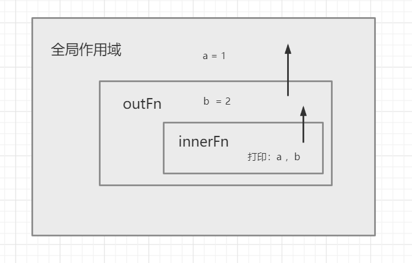

<div align='center' ><font size='70'>作用域</font></div>

## 1.作用域

作用域是在运行时代码中的某些特定部分中变量，函数和对象的可访问性。
作用域决定了代码区块中的变量和其他资源的可见性。

**示例**
```javascript
function fn() {
    var a = "函数内变量";
}
fn();
console.log(a); // a is not defined
```
从上面的例子可以看出,在函数内定义的变量（属于函数作用域），函数外（全局作用域）无权访问，使用函数内的变量会直接报错。因为这里有一个我们看不见的区间，也就是上面所说的作用域。

**作用域就是一个单独的区域，让变量不会外泄，不会暴露出去，作用域最大的作用就是防止变量泄露（隔离变量）。不同作用域下相同变量名也不会发生冲突。**

## 2.全局作用域

**全局作用域的几种情况：**

* 最外层的函数和在最外层函数外面定义的变量拥有全局作用域。
```javascript
var outVar = "我是最外层变量";
function fn(){
    var innerVar = "我是内层变量";
    function fn1() {
        console.log(innerVar);
    }
    fn1();
}
console.log(outVar); // 我是最外层变量
fn(); //我是内层变量
console.log(innerVar); //innerVar is not defined
fn1(); // fn1 is not defined
```
**说明：**
outVar 是在最外层函数外定义的变量，所以是全局变量，能够打印出outVar。fn()执行触发fn1()执行，所以打印出innerVar。在最外层打印innerVar则报错，因为在innerVar不是全局作用域下的。

* 所有未定义直接赋值的变量会自动声明为全局变量，拥有全局作用域。

```javascript
function fn(){
    var a = 100;
    b = 10;
}
fn(); // 先执行这个函数
console.log(b); // 10 
console.log(a); //  a is not defined
```
* 所有window对象的属性拥有全局作用域。

一般情况下，window对象的内置属性都拥有全局作用域，例如window.name、window.location、window.top等等。

## 3.全局作用域的弊端

如果我们写了很多行 JS 代码，变量定义都没有用函数包括，那么它们就全部都在全局作用域中。这样就会 污染全局命名空间, 容易引起命名冲突。
```javascript
    // 陈某的代码
    var data = 100;
    ...
    // 王某的代码
    var data = "cht";   
    
    // 不经意见就会造成变量冲突
```
 jQuery、Zepto 等库的源码，所有的代码都会放在(function(){....})()中。因为放在里面的所有变量，都不会被外泄和暴露，不会污染到外面，不会对其他的库或者 JS 脚本造成影响。这也是函数作用域的一个体现。
 
## 4.函数作用域
 
 * 函数作用域是指在函数内部声明的变量。
 ```javascript
function fn() {
    var a = '函数内变量'
}
console.log(a); // a is not defined
```

**作用域访问规则：**

* 作用域是分层的，内部作用域可以向上(向外)访问外层作用域的变量，反之则不行。

```javascript
var a = 1;
function outFn() {
    var b = 2
    console.log(a);    // 1
    function innerFn() {
        console.log(b);  // 2
    }
    innerFn();
}
outFn();
console.log(b);  // b is not defined ===> b是内层变量，在外层访问不到
```
**图解：**

 图片中展示的是各个作用域的分布，箭头展示从内到外的可以访问范围。innerFn可以访问到外层作用域中的变量。
 
**注意：es5中没有块级作用域的概念，也并不是用大括号包裹的就一定是单独作用域**

块语句（大括号“｛｝”中间的语句），如 if 和 switch 条件语句或 for 和 while 循环语句，不像函数，它们不会创建一个新的作用域。在块语句中定义的变量将保留在它们已经存在的作用域中。

```javascript
//'if' 条件语句块不会创建一个新的作用域
if(true) {
    var a = 1;
}
console.log(a); // 1
```
## 5.块级作用域

ES6中新增块级作用域得概念，块级作用域使用 const 和 let 声明，声明得变量在指定得块作用域外无法被访问到。

**块级作用域的创建*

块级作用域可通过新增命令let和const声明，所声明的变量在指定块的作用域外无法被访问。块级作用域在如下情况被创建:
* 在一个函数内部
* 在一个代码块内部（由花括号包裹）

let 声明的语法与 var 的语法一致。你基本上可以用 let 来代替 var 进行变量声明，但会将变量的作用域限制在当前代码块中。块级作用域有以下几个特点：

* 声明变量不会提升到代码块顶部
```javascript
function getValue(condition) {
if (condition) {
let value = "blue";
return value;
} else {
// value 在此处不可用
return null;
}
// value 在此处不可用
}
```
* 禁止重复声明
```javascript
var count = 30;
let count = 40; // Uncaught SyntaxError: Identifier 'count' has already been declared
```
如果不再同一个作用域中，可以使用let 声明一个同名的变量。
```javascript
var count = 30;
// 不会抛出错误
if (condition) {
let count = 40;
// 其他代码
}
```
## 6.循环中的绑定块作用域的妙用
使用let声明一个块级内的变量，可以把声明的计数器变量限制在循环内。
```javascript
for (let i = 0; i < 10; i++) {
  // 计数器变量是用let声明的，当使用的时候，只能在内部被访问到，在外面访问则会报错。
}
console.log(i);
// ReferenceError: i is not defined

```
**对比：** 
```javascript
// demo1
for(var i = 0 ; i<10 ; i++ ) {
    console.log(i); // 0123456789
}
console.log(i); // 10 这里永远打印的都是10 因为上面使用var 声明了计数器，这个计数器是全局使用的，也就是说，我们访问的都是同一个i，这一行代码只有最后能被访问到。

// demo2
var a = [];
for (var i = 0; i < 10; i++) {
  a[i] = function () {
    console.log(i);
  };
}
a[6](); // 10
a[5](); // 10
a[4](); // 10
```
**说明：**

上面demo2代码中，变量i是var命令声明的，在全局范围内都有效，所以全局只有一个变量i。每一次循环，变量i的值都会发生改变，而循环内被赋给数组a的函数内部的console.log(i)，里面的i指向的就是全局的i。也就是说，所有数组a的成员里面的i，指向的都是同一个i，导致运行时输出的是最后一轮的i的值，也就是 10。
 
 ```javascript
// 改版
var a = [];
for (let i = 0; i < 10; i++) {
  a[i] = function () {
    console.log(i);
  };
}
a[6](); // 6   这里使用let 声明，声明的变量仅在块级作用域内有效

```
**说明：**

上面改版代码中，变量i是let声明的，当前的i只在本轮循环有效，所以每一次循环的i其实都是一个新的变量，所以最后输出的是6。你可能会问，如果每一轮循环的变量i都是重新声明的，那它怎么知道上一轮循环的值，从而计算出本轮循环的值？这是因为 JavaScript 引擎内部会记住上一轮循环的值，初始化本轮的变量i时，就在上一轮循环的基础上进行计算。


 
 