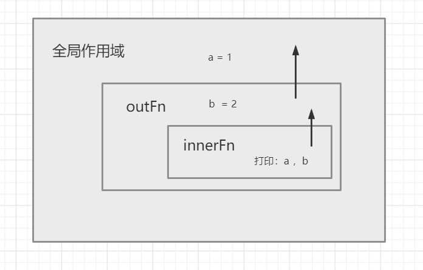

<div align='center' ><font size='70'>作用域链</font></div>

## 1.什么是作用域？

作用域是在运行时代码中的某些特定部分中变量，函数和对象的可访问性。
作用域决定了代码区块中的变量和其他资源的可见性。

**示例**
```javascript
function fn() {
    var a = "函数内变量";
}
fn();
console.log(a); // a is not defined
```
从上面的例子可以看出,在函数内定义的变量（属于函数作用域），函数外（全局作用域）无权访问，使用函数内的变量会直接报错。因为这里有一个我们看不见的区间，也就是上面所说的作用域。

**作用域就是一个单独的区域，让变量不会外泄，不会暴露出去，作用域最大的作用就是防止变量泄露（隔离变量）。不同作用域下相同变量名也不会发生冲突。**

## 2.全局作用域和函数作用域

**全局作用域的几种情况：**

* 最外层的函数和在最外层函数外面定义的变量拥有全局作用域。
```javascript
var outVar = "我是最外层变量";
function fn(){
    var innerVar = "我是内层变量";
    function fn1() {
        console.log(innerVar);
    }
    fn1();
}
console.log(outVar); // 我是最外层变量
fn(); //我是内层变量
console.log(innerVar); //innerVar is not defined
fn1(); // fn1 is not defined
```
**说明：**
outVar 是在最外层函数外定义的变量，所以是全局变量，能够打印出outVar。fn()执行触发fn1()执行，所以打印出innerVar。在最外层打印innerVar则报错，因为在innerVar不是全局作用域下的。

* 所有未定义直接赋值的变量会自动声明为全局变量，拥有全局作用域。

```javascript
function fn(){
    var a = 100;
    b = 10;
}
fn(); // 先执行这个函数
console.log(b); // 10 
console.log(a); //  a is not defined
```
* 所有window对象的属性拥有全局作用域。

一般情况下，window对象的内置属性都拥有全局作用域，例如window.name、window.location、window.top等等。

* 全局作用域的弊端

如果我们写了很多行 JS 代码，变量定义都没有用函数包括，那么它们就全部都在全局作用域中。这样就会 污染全局命名空间, 容易引起命名冲突。
```javascript
    // 陈某的代码
    var data = 100;
    ...
    // 王某的代码
    var data = "cht";   
    
    // 不经意见就会造成变量冲突
```
 jQuery、Zepto 等库的源码，所有的代码都会放在(function(){....})()中。因为放在里面的所有变量，都不会被外泄和暴露，不会污染到外面，不会对其他的库或者 JS 脚本造成影响。这也是函数作用域的一个体现。
 
 **函数作用域**
 
 * 函数作用域是指在函数内部声明的变量。
 ```javascript
function fn() {
    var a = '函数内变量'
}
console.log(a); // a is not defined
```

**作用域访问规则：**

* 作用域是分层的，内部作用域可以向上(向外)访问外层作用域的变量，反之则不行。

```javascript
var a = 1;
function outFn() {
    var b = 2
    console.log(a);    // 1
    function innerFn() {
        console.log(b);  // 2
    }
    innerFn();
}
outFn();
console.log(b);  // b is not defined ===> b是内层变量，在外层访问不到
```
**图解：**

 图片中展示的是各个作用域的分布，箭头展示从内到外的可以访问范围。innerFn可以访问到外层作用域中的变量。
 
**注意：es5中没有块级作用域的概念，也并不是用大括号包裹的就一定是单独作用域**

块语句（大括号“｛｝”中间的语句），如 if 和 switch 条件语句或 for 和 while 循环语句，不像函数，它们不会创建一个新的作用域。在块语句中定义的变量将保留在它们已经存在的作用域中。

```javascript
//'if' 条件语句块不会创建一个新的作用域
if(true) {
    var a = 1;
}
console.log(a); // 1
```
**块级作用域**

ES6中新增块级作用域得概念，块级作用域使用 const 和 let 声明，声明得变量在指定得块作用域外无法被访问到。

**块级作用域的创建**
* 在一个函数内部
* 在一个代码块内部（由花括号包裹）
 
 
 
 
 