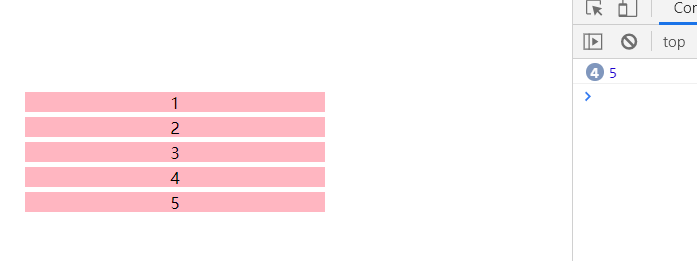
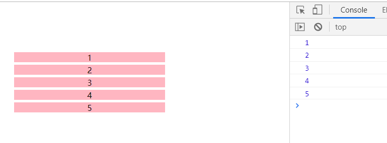

<div align='center' ><font size='70'>闭包</font></div>

---------

## 1.感受闭包

简单的例子感受闭包

```javascript
var n = 100;
function fn() {
   console.log(n); 
}
fn() // 100
```
从上面代码中，函数fn可以读取全局变量n。但是，函数外部无法读取函数内部声明的变量。看下面：

```javascript
function fn() {
    var n = 100;
}
fn() // 报错
```
从上面可以看出，当我们想要在外面访问函数内部的变量的，正常情况下是办不到的。但是我们可以这样做：

```javascript
function fn() {
    var n = 100;
    function fn1() {
        console.log(n);
    }
    fn1()
}
fn();
```
函数fn1就在函数fn内部，这时fn内部的所有局部变量，对fn1都是可见的。既然fn1可以读取fn的局部变量，那么只要把fn1作为返回值，即可！

**修改最终版本：**

```javascript
function fn() {
    var n = 100;
    return function fn1() {
        console.log(n);
    }
}
fn()(); // 100
```
闭包就是函数fn1，即能够读取其他函数内部变量的函数。

**个人理解：闭包就是函数中的函数,里面的函数可以访问外面函数的变量，外面的变量的是这个内部函数的一部分。**

## 2.闭包形成条件

* 函数嵌套
* 内部函数引用外部函数的局部变量

## 3.闭包的特性
每个函数都是闭包，每个函数天生都能够记忆自己定义时所处的作用域环境。不管函数走到哪里，定义时的作用域就带到了哪里。

```javascript
// 实例1
var inner;
function outer(){
var a=250;
inner=function(){
alert(a);//这个函数虽然在外面执行，但能够记忆住定义时的那个作用域，a是250
  }
}
outer();
var a=300;
inner();//一个函数在执行的时候，找闭包里面的变量，不会理会当前作用域。
```

```javascript
//实例2
function outer(x){
  function inner(y){
  console.log(x+y);
  }
return inner;
}
var inn=outer(3);//数字3传入outer函数后，inner函数中x便会记住这个值
inn(5);//当inner函数再传入5的时候，只会对y赋值，所以最后打印8
```

## 4.闭包的内存泄露

栈内存提供一个执行环境，即作用域，包括全局作用域和私有作用域,那么什么时候被释放呢？

* **全局作用域----只有当页面关闭的时候全局作用域才会销毁**
* **私有的作用域----只有函数执行才会产生**

一般情况下，函数执行会形成一个新的私有的作用域，当私有作用域中的代码执行完成后，我们当前作用域都会主动的进行释放和销毁。
但当遇到函数执行返回了一个引用数据类型的值，并且在函数的外面被一个其他的东西给接收了，这种情况下一般形成的私有作用域都不会销毁。

```javascript
function fn(){
var num=100;
return function(){
  }
}
var f=fn();//fn执行形成的这个私有的作用域就不能再销毁了

f = null // 销毁
```
fn函数内部的私有作用域会被一直占用的，发生了内存泄漏。

**所谓内存泄漏指任何对象在你不再拥有或需要它之后仍然存在。闭包不能滥用，否则会导致内存泄露，影响网页的性能。闭包使用完了后，要立即释放资源，将引用变量指向null。**

**面试题**

```javascript
  function outer(){
        var num = 0;    //内部变量
        return function add(){      //通过return返回add函数，就可以在outer函数外访问了
                num++;     //内部函数有引用，作为add函数的一部分了
                console.log(num);
                };
 }
  var func1 = outer();   // func1 引用，如果不销毁将造成内存泄漏
  func1();     //实际上是调用add函数， 输出1
  func1();     //输出2 因为outer函数内部的私有作用域会一直被占用
  var func2=outer();
  func2();    // 输出1  每次重新引用函数的时候，闭包是全新的。
  func2();    // 输出2
```
## 5.闭包的作用

1.**可以读取函数内部的变量。**

2.**可以使变量的值长期保存在内存中。但不能滥用闭包，否则会造成网页的性能问题。**

3.**可以用来实现JS模块。**

JS模块:具有特定功能的js文件,将所有的数据和功能都封装在一个函数内部(私有的),只向外暴露一个包括n个方法的对象或函数,模块的使用者,只需要通过模块暴露的对象调用方法来实现对应的功能。

```html
<!--index.html文件-->
<script type="text/javascript" src="myModule.js"></script>
<script type="text/javascript">
  myModule2.doSomething()
  myModule2.doOtherthing()
</script>
```

```javascript
//myModule.js文件
(function () {
  var msg = 'Beijing'//私有数据
  //操作数据的函数
  function doSomething() {
    console.log('doSomething() '+msg.toUpperCase())
  }
  function doOtherthing () {
    console.log('doOtherthing() '+msg.toLowerCase())
  }
  //向外暴露对象(给外部使用的两个方法)
  window.myModule2 = {
    doSomething: doSomething,
    doOtherthing: doOtherthing
  }
})()
```

## 6.闭包的实际应用

需求： 点击li，打印点击的是第几个

```
<ul>
  <li class='item'>1</li>
  <li class='item'>2</li>
  <li class='item'>3</li>
  <li class='item'>4</li>
  <li class='item'>5</li>
</ul>

var list = document.querySelectorAll('.item');
for(var i = 0 ; i<list.length ; i++) {
    list[i].onclick = function () {
           console.log(i+1);
    }
}
```



如图，打印出来的都是 5，和我们的预期不一样。调整如下：

**方式一**

```
<ul>
  <li class='item'>1</li>
  <li class='item'>2</li>
  <li class='item'>3</li>
  <li class='item'>4</li>
  <li class='item'>5</li>
</ul>

var list = document.querySelectorAll('.item');
for(let i = 0 ; i<list.length ; i++) {
    list[i].onclick = function () {
           console.log(i+1);
    }
}
```
**方式二**
利用闭包
```javascript
        var list = document.querySelectorAll('.item');
        for(let i = 0 ; i<list.length ; i++) {
         (function(j) {
             list[j].onclick = function(){
                 console.log(j+1);
             }
         })(i)
        }
```



