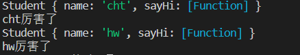

<div align='center'><font size='70'>JS栈内存和堆内存</font></div>

------

## 1.创建自定义对象的方法

**对象字面量**

```javascript
// 简单的对象
var obj = { 
    name:'cht'
}
// 复杂的对象
const obj2 = {
            name: "cht",
            age: 1,
            isBoy: true,
            // 还可以存放一个嵌套的对象
            test: {
                id: 123,
                tel: 180xxxxx
            }
		    //还可以在对象中增加一个方法。以后可以通过obj.sayName()的方式调用这个方法
            sayName: function() {
                console.log(this.name);
            }
        };
```

**工厂模式(new Object)**

大量生产对象

```javascript
function  creatObj(name,age) {
    let obj = new Object();
    obj.name = name;
    obj.age = age;
    obj.sayName = function() {
        console.log(this.name);
    }
    return obj;
}
var p = new creatObj("cht",1);
var p1 = new creatObj('hw',2);
```
**使用工厂方法创建的对象，使用的构造函数都是 Object。所以创建的对象都是 Object 这个类型，就导致我们无法区分出多种不同类型的对象**

**构造函数**

```javascript
//利用构造函数自定义对象
var stu1 = new Student('cht');
console.log(stu1);
stu1.sayHi();

var stu2 = new Student('hw');
console.log(stu2);
stu2.sayHi();

// 创建一个构造函数
function Student(name) {
    this.name = name; //this指的是当前对象实例【重要】
    this.sayHi = function () {
        console.log(this.name + '厉害了');
    };
}
```
**结果:**



## 2.构造函数

### 体验构造函数

```javascript
// 创建一个构造函数，专门用来创建Person对象
function Person(name, age, gender) {
    this.name = name;
    this.age = age;
    this.gender = gender;
    this.sayName = function () {
        alert(this.name);
    };
}

var per = new Person('孙悟空', 18, '男');
var per2 = new Person('玉兔精', 16, '女');
var per3 = new Person('奔波霸', 38, '男');

// 创建一个构造函数，专门用来创建 Dog 对象
function Dog() {}

var dog = new Dog();
```
### 构造函数概念

**构造函数：是一种特殊的函数，主要用来创建和初始化对象，也就是为对象的成员变量赋初始值。它与 `new` 一起使用才有意义。**

我们可以把对象中一些公共的属性和方法抽取出来，然后封装到这个构造函数里面。

### 构造函数和普通函数的区别

构造函数的创建方式和普通函数没有区别，不同的是构造函数习惯上首字母大写。

普通函数是直接调用，而构造函数需要使用 new 关键字来调用

### this的指向问题

1. 以函数的形式调用时，this 永远都是 window。比如`fun();`相当于`window.fun();`
2. 以方法的形式调用时，this 是调用方法的那个对象。
3. 以构造函数的形式调用时，this 是新创建的实例对象。

### new 一个构造函数的执行流程

new 在执行时，会做下面这四件事：

（1）开辟内存空间，在内存中创建一个新的空对象。

（2）让 this 指向这个新的对象。

（3）执行构造函数里面的代码，给这个新对象添加属性和方法。

（4）返回这个新对象（所以构造函数里面不需要 return）。

```javascript
function creatPerson(name) {
    var student = new Object();
    //第一个name指的是student对象定义的变量。第二个name指的是createPerson函数的参数，二者不一样。
    student.name = name;
}
```
改进后
```javascript
function creatPerson(name) {
    this.name = name;  // this指的是构造函数中的对象实例
}
```

### 静态成员和实例成员

JavaScript 的构造函数中可以添加一些成员，可以在构造函数本身上添加，也可以在构造函数内部的 this 上添加。通过这两种方式添加的成员，就分别称为静态成员和实例成员。

* 静态成员：在构造函数本上添加的成员称为静态成员，只能由构造函数本身来访问。
* 实例成员：在构造函数内部创建的对象成员称为实例成员，只能由实例化的对象来访问。

```javascript

function Person(name,age,sex) {  
    // 这些属于实例成员
    this.name = name;
    this.age = age;
    this.sex = sex;
}
var p1 = new Person("cht");
console.log(p1.name);  // cht  实例方法能被实例化对象访问。
//静态成员， job不能被实例所调用
Person.job = "Teacher";
```
### 类与实例

* 使用同一个构造函数创建的对象，我们称为一类对象，也将一个构造函数称为一个**类**。

* 通过一个构造函数创建的对象，称为该类的**实例**。

```javascript
// Person是一个类
function Person(name,age) {
    this.name = name;
    this.age = age;
}
// p1 是一个实例对象。或者说：Person这个类的实例对象是p1
var p1 = new Person("cht");
```


