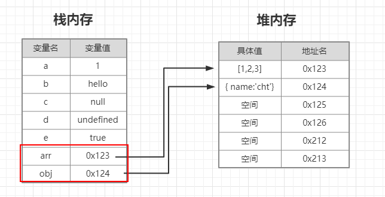
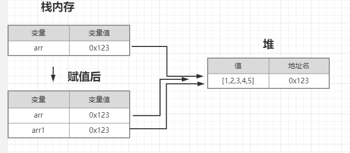

<div align='center' ><font size='70'>JS栈内存和堆内存</font></div>

---------
## 1.JS中类型的介绍

**JavaScript中的变量分为【基本类型】和【引用类型】**

1. JS中的基本类型就5种: Undefined Null Boolean Number String,它们都是按值之间存储在栈中。

* 存放于栈内存（Stack）中
* 基本类型的值是按值访问
* 基本类型值是不可改变的 （改变的只是指针的指向）
* 基本类型的比较是它们值得比较


2. JS中的引用类型包括: Object Array Function RegExp,它们都是存储在堆内存中，栈中只是存放内存地址指针。

* 引用类型的值是保存在堆内存（Heap）中的对象
* 引用类型的值是按引用访问的
* 引用类型的值是可变的
* 引用类型的比较是引用的比较

## 2.代码展示于图列
```javascript
    var a = 1;  // 栈
    var b = 'hello'; // 栈
    var c = null; // 栈
    var d = undefined; // 栈
    var e = true; // 栈
    var arr = [1,2,3]; // 变量f 存储于 栈   [1,2,3]存储于堆
    var obj = { name:'cht'}; // 变量 obj 存储于 栈  {name:'cht'} 存储于堆
```



**解释:**

* 基本类型值存放于栈内存中，它的值不能改变，改变的是指针的指向。

* 引用类型的值存放于堆内存中，值指针指向存在于堆内存中。

**访问堆内存中的数据类型的步骤：**

1. 从栈中获取该对象的地址引用
2. 再从堆内存中获取数据

## 3.基本类型赋值
**第一种：**
```javascript
    var a = 200 ; 
    var b = a ; 
    b = 100;
    console.log(a); // 200
```
**解释：**
* 一个变量向另一个变量赋基本类型值，会在变量对象上创建一个新值，然后把该值复制到新变量分配的位置上。
* 赋值结束后，a 和 b 是互不影响的两个变量。

**第二种：**
```javascript
    var a = 200 ; 
    a = 300 ; 
    console.log(a); // 300
```
**解释：**
* 第二种方式：单从结果上看 a 的值发生了变化。其实 a 只是指向 200 的一个指针，指针的指向是可以改变的，所以我们能够 通过 a=300 来修改 a 的指向。
此时 a 指向了300，这里的300也是不可修改的。也就是说：我们认为的 a 的值发生了修改，只是 【指针指向的改变】

## 4.引用类型的赋值

```javascript
    var arr = [1,2,3,4,5];
    var arr1 = arr;
    arr.push(6);
    console.log(arr , arr1); // [ 1, 2, 3, 4, 5, 6 ] [ 1, 2, 3, 4, 5, 6 ]
```
**解释：**
* 当一个变量向另一个变量赋引用类型值得时候，其实是复制堆内存的地址。这个地址指向的是堆内存中的对象。
* 赋值结束后，两个变量都保存了同一个堆内存的地址，所以指向同一个对象。当变量 arr 修改堆内存中的值时，两一个变量也修改。



## 5.堆和栈的对比

栈内存|堆内存
--|:--:
存储基础数据类型|存储引用数据类型
按值访问|按引用访问
存储的值大小固定|存储的值大小不定，可动态调整
由系统自动分配内存空间|由代码进行指定分配
空间小，运算效率高|空间大，运行效率相对较低
存储的值大小固定先进后出，后进先出|无序存储，可根据引用直接获取


[优质文章1](https://mp.weixin.qq.com/s/YMpKnUUKPPIG6FD6CGzfTg)

[优质文章2](https://www.cnblogs.com/zhuyeshen/p/10997893.html)
