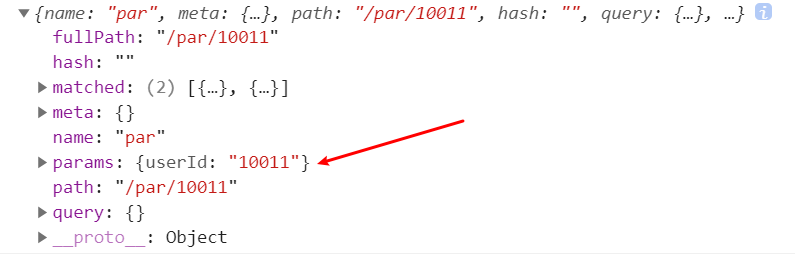
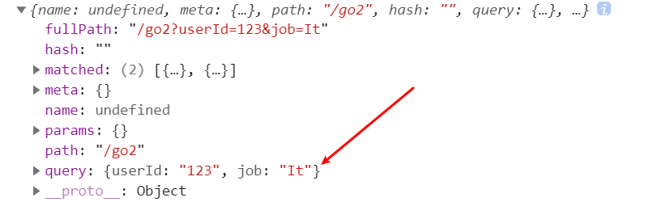

<div align='center' ><font size='70'>路由传参</font></div>

-------

## 方式一:name
**使用name属性，进行匹配，通过params传递参数**

* 这个方法有一个小问题：跳转结束后，刷新页面，传递过来的参数会丢失。
* 解决方法是在路由的path字段中添加参数，但是这个参数会显示在url的后面，多个参数也可也往后添加。


**路由配置(要跳转的路由)**
```javascript
{
     path:'/par',
     name:'par',
     component:resolve => require(['@/page/params/par'], resolve)
}

// 解决刷新丢失的问题: 在path后面跟上参数，这样这个参数显示在url后面。
{
      path:'/par/:userId',
      name:'par',
      component:resolve => require(['@/page/params/par'], resolve)
}
```

```vue
// params.vue
<template>
    <div>
        // 描述： 点击按钮跳转路由，传递 userId过去
        <el-button type='primary' @click='go'>跳转</el-button>
    </div>
</template>
<script>
export default {
    methods:{
        go() {
            this.$router.push({
                name:"par",//这个name就是你刚刚配置在router里边的name
                params:{
                    userId:"100"
                }
            })

        }
    }
}
</script>
```
:::warning
正常我们在写this.$router.push()时候，我们都会添加path指定要跳转的路由。
在这里，我们使用name匹配路由的时候，不能写path
否则你在取参数的时候this.$router.params.userId就是undefined。这是因为，params只能用name来引入路由。
:::

```vue
// par.vue (要跳转的页面)
<template>
    <div>
         {{id}}
    </div>
</template>
<script>
export default {
    data(){
        return { id:''}
    },
    mounted() {
        this.id = this.$route.params.userId;
        console.log('路由跳转的参数-----',this.$route.params.userId);
    },
    
}
</script>
```
**获取路由传递的参数： this.$route.params.userId**

* 打印 this.$route


## 方式二:query传参
**使用query传递参数：会显示在url后面。例如：http://localhost:8080/#/go2?userId=123&job=It**
```javascript
// 路由配置
 {
    path:'/go2',
    component:resolve => require(['@/page/params/go2'], resolve)
}
```
**使用编程式路由，添加query字段**
```vue
// params页面,点击跳转页面
<template>
    <div>
        <el-button type='primary' @click='go2'>跳转2</el-button>
    </div>
</template>
<script>
export default {
    methods:{
        go2() {
            this.$router.push({
                path:'/go2',
                query: {
                    userId:123,
                    job:'It'
                }
            })
        }
    }
}
</script>
```
**取值的两种方式区分**
```vue
// go2.vue 取值页面
<script>
export default {
    mounted() {
        console.log(this.$route);
        // 取值方式一：
        console.log(this.$route.query.userId);
        // 取值方式二：
        console.log(this.$router.currentRoute.query.userId);
    }
}
</script>
```

* 打印 this.$route


:::warning
query传参，默认路由配置即可。
使用$router.push() 配置 path 和 query 即可。
获取参数使用this.$route.query.userId  或者  this.$router.currentRoute.query.userId。
:::

## 方式三:router-link

```javascript
{
    path:'/go3',
    component:resolve => require(['@/page/params/go3'], resolve)
}
```

**使用router-link的to属性，需要v-bind绑定**
```vue
// params.vue
<router-link  :to="{path:'/go3', query:{userId:456,job:'It'}}">go3</router-link>
```

**参数获取**
```vue
<script>
export default {
    mounted() {
        console.log(this.$route);
        console.log(this.$route.query.userId)
    }
}
</script>
```


