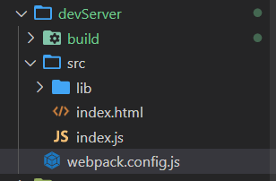

<div align='center' ><font size='70'>devServer</font></div>

----------

**目录结构**



1. devServer特点

* 用来自动化（自动编译，打开刷新浏览器
* 只会在内存中编译打包，不会有任何输出。

2. 下载devServer
```
// 安装命令
cnpm i webpack-dev-server -D
```

3. webpack.config.js

```javascript

const { resolve }  = require("path");
const HtmlWebpackPlugin = require("html-webpack-plugin");
module.exports = {
    entry:"./src/index.js",
    output:{
        filename: "built.js",
        path: resolve(__dirname , 'build')
    },
    module:{
        rules:[
            {
                test:/\.css$/ ,
                use:[ 'style-loader' , "css-loader"]
            },
            {
                test: /\.(eot|svg|ttf|woff|woff2)(\?\S*)?$/,
                loader: 'file-loader'
            }
        ]
    },
    plugins:[
        new HtmlWebpackPlugin( {
            template:"./src/index.html"
        })
    ],
    mode:"development",
    // 运行 命令： npx webpack-dev-server
    devServer:{
        // 指定服务器运行打包后的目录
        contentBase: resolve(__dirname , 'build'),
        // 启动 gzip 压缩
        compress:true,
        // 指定端口号
        port:3000
    }
}
```   
4. 启动服务器
```
// 命令 
npx webpack-dev-server
```
     