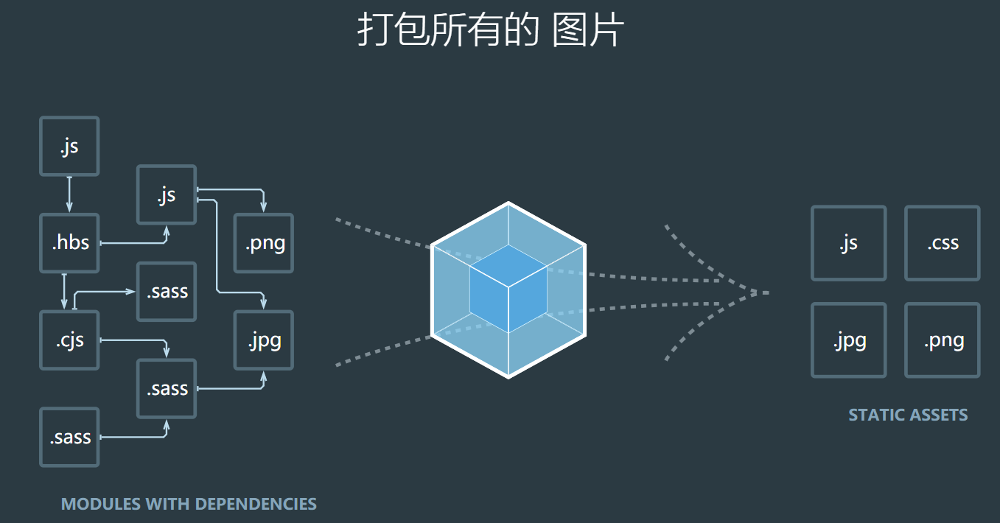

<div align='center'><font size='70'>webpack介绍</font></div>

----------




## 什么是webpack?

从上面的图片即可看出来。
webpack的理念就是一切皆模块化，把一堆的css文件和js文件放在一个总的入口文件，通过require引入，剩下的事情webpack会处理，包括所有模块的前后依赖关系，打包、压缩、合并成一个js文件，公共代码抽离成一个js文件、某些自己指定的js单独打包，模块可以是css/js/imsge/font等等。


## webpack的基本能力

**处理依赖、模块化、打包**

1、依赖管理：方便引用第三方模块，让模块更容易复用、避免全局注入导致的冲突、、避免重复加载或者加载不必要的模块。

2、合并代码：把各个分散的模块集中打包成大文件，减少HTTP的链接的请求次数，配合uglify.js可以减少、优化代码的体积。

3、各种插件：babel把ES6+转化为ES5-，eslint可以检查编译时的各种错误。

## 使用场景

1、根据模板生成HTML，并自动处理上面的css/js引用路径

2、自动处理里面的图片路径，css里面背景图的路径，字体引用

3、开启本地服务器，一边改写代码，一边自动更新页面内容

4、编译jsx    es6     sass     less    coffescript等，并添加md5、sourcemap等辅助

5、异步加载内容，不需要时不加载到DOM

6、配合vue.js    react.js等框架开发

## 安装命令

```
执行:npm init
全局安装： npm i webpack webpack-cli -g
查看版本：webpack -v
本地安装：npm i webpack webpack-cli -D   
指定版本号：cnpm i webpack@4.41.6 webpack-cli@3.3.11 -D
开发环境： webpack ./src/index.js -o ./build/built.js --mode=development
生产环境： webpack ./src/index.js -o ./build/built.js --mode=production

```