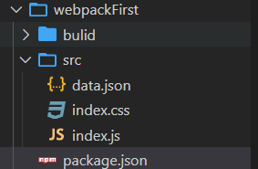

<div align='center' ><font size='70'>初体验</font></div>

-------

**目录结构**

这是整个目录解构，下面一步一步来。



1. 首先创建一个文件夹，进入当前文件夹 webpackFirst，初始化项目文件。

```
执行:npm init
```

2. 下载依赖包   全局安装 webpack 和 webpack-cli

```
执行： npm i webpack webpack-cli -g
查看版本：webpack -v
```
:::warning
注意： webpack 4.x 版本以上，webpack将相关命令内容都放到了webpack-cli，必须安装webpack-cli

webpack-cli 查看版本：webpack -v
:::
3. 本地安装webpack-cli

```
npm i webpack webpack-cli -D   

指定版本号：cnpm i webpack@4.41.6 webpack-cli@3.3.11 -D
```
4. 当前目录下创建src 文件，在src中创建入口文件index.js

```javascript
/**
 * index.js 是 webpack 的入口文件，即是entry,创建示例代码:js任意语句。
 *
 * 运行命令 ：
 *           开发环境执行:  webpack ./src/index.js -o ./build/built.js --mode=development
 *           webpack 会以 ./src/index.js 为入口文件开始打包 ，打包后输出到 ./build/built.js 整体打包环境是 开发环境
 *           生产环境执行： webpack ./src/index.js -o ./build/built.js --mode=production
 *
 *  webpack 能够打包js资源 json资源
 *
 * */
function add(x,y) {
    return x+y;
}
console.log(add(1,2));

```
5. 运行项目

```
开发环境： webpack ./src/index.js -o ./build/built.js --mode=development

生产环境： webpack ./src/index.js -o ./build/built.js --mode=production
```
6. 查看运行成功结果

```javascript
    //  注释： 运行命令成功后，控制台输出如下信息 ：
        Hash:  // 每一次打包生成一个唯一值，类似于id。  例如：  Hash: ad9e8a280a99560b2840
        Version： // webpack的版本               例如： Version: webpack 4.44.2
        Time:  // 打包所用时间                         Time: 138ms
    //  打包具体信息：
        Built // at: 2020-11-11 11:27:47
        Asset       Size        Chunks             Chunk Names
        built.js    3.84 KiB    main  [emitted]    main
        Entrypoint main = built.js
        [./src/index.js] 63 bytes {main} [built]
```
7. 在src中创建data.json

```javascript
// data.json
{
  "name": "cht" , "job": "dev"
}

// index.js
import data from './data.json';  // 引入
console.log(data);
function add(x,y) {
    return x+y;
}
console.log(add(1,2));
```
**运行成功即打包成功**

8. 在src中创建index.css,并引入。 打包失败！！！！！

```css
html, body {
    height: 100%;
    background: #9a6e3a;
}
```

```javascript
        // 错误如下： 大致意思是：打包错误，你需要一个loader 去处理这个文件类型
        ERROR in ./src/index.css 1:5
        Module parse failed: Unexpected token (1:5)
        You may need an appropriate loader to handle this file type, currently no loaders are configured to process this file. 
        > html body {
        |     height: 100%;
        |     background: #9a6e3a;
         @ ./src/index.js 13:0-21
```

**通过上面的测试得知：**

* webpack 能够打包js json 文件。但是不能够打包 css img 文件。
* webpack 的开发环境和生产环境能够将ES6模块化-编译成浏览器识别的模块化。
* webpack 的生产环境比开发环境多一个 代码压缩功能。

