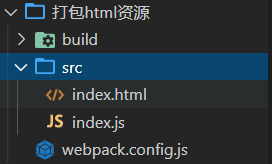

<div align='center' ><font size='70'>打包html资源</font></div>

------------

**目录结构**



1. 新建一个文件夹， 并创建一个src文件，在src中创建 index.js 入口文件，和 index.html 文件。

2. 初始化项目及安装webpack-cli等不详细写,看上一篇。

3. html 打包需要使用  html-webpack-plugin依赖。

```javascript
    // plugins 使用：  1. 下载  2.引入  3. 使用
    // 运行命令：
    1.cnpm  i html-webpack-plugin -D
    // 引用：
    2. const HtmlWebpackPlugin = require("html-webpack-plugin");
    // 使用
    3. new HtmlWebpackPlugin()

```
4. webpack.config.js配置

```javascript
/**
 * plugins 使用 ：  1. 下载   2， 引入  3. 使用
 *
 * */
const { resolve }  = require("path");
const HtmlWebpackPlugin = require("html-webpack-plugin");
module.exports = {
    entry:'./src/index.js',
    output:{
        filename:"built.js",
        path:resolve(__dirname , 'build')
    },
    module:{
        // loader 配置
        rules:[]
    },
    // plugins配置
    plugins:[
        // html-webpack-plugin
        // 共能：默认会创建一个空的HTML，自动引入打包输出的所有（JS/CSS）资源
        // 如果需要有结构的HTML 文件，要在 HtmlWebpacePlugin构造函数中配置 template 如下
        new HtmlWebpackPlugin({
            // 复制 ./src/index.html  文件结构， 并自动引入 JS Css等资源
            template:'./src/index.html'
        })
    ],
    mode:"development"
}
```
5. 运行项目

```
webpack
```
:::warning
打包后我们发现， HtmlWebpackPlugin 会默认创建一个空的HTML文件，并且自动引入打包输出的所有 JS css 资源

如果我们想把 index.html 文件结构放到 打包自动创建的index.html中， 需要在HtmlWebpackPlugin()构造函数中 配置 template.
:::
