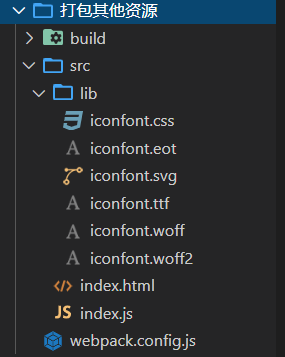

<div align='center' ><font size='70'>打包其他资源</font></div>

-------------

**目录结构**



1. 新建文件，创建src ... 引入字体图标文件 并且在 index.js中引入
```javascript
// index.js
// 引入字体图标库
import './lib/iconfont.css'
```
初始化项目及安装webpack-cli等不详细说明。

2. 配置loader 
```javascript
// webpack.config.js

const { resolve }  = require("path");
const HtmlWebpackPlugin = require("html-webpack-plugin");
module.exports = {
    entry:"./src/index.js",
    output:{
        filename: "built.js",
        path: resolve(__dirname , 'build')
    },
    module:{
        rules:[
            {
                test:/\.css$/ ,
                use:[ 'style-loader' , "css-loader"]
            },
            {
                test: /\.(eot|svg|ttf|woff|woff2)(\?\S*)?$/,
                loader: 'file-loader'
            }
        ]
    },
    plugins:[
        new HtmlWebpackPlugin( {
            template:"./src/index.html"
        })
    ],
    mode:"development"
}
```
3. 下载依赖  

```javascript
cnpm i file-loader -D
```

4. 运行 webpack 即可打包。