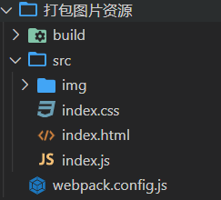

<div align='center' ><font size='70'>打包图片资源</font></div>

----------------

**目录结构**



1. 新建我一个文件夹， 并创建src， 在src中创建 index.js  index.css ,index.html  和 img文件夹， 在 img中放入图片。

2. 我们把图片，作为背景图片 放到index.html 中。

```html
<!DOCTYPE html>
<html lang="en">
<head>
    <meta charset="UTF-8">
    <title>Title</title>
</head>
<body>
    <div id="box1"></div>
    <div id="box2"></div>
    <div id="box3"></div>
    <!--html中使用图片，直接打包无效，需要安装loader-->
    
</body>
</html>
```

3. 安装loader  
```
运行命令 ： cnpm i url-loader file-loader -D
```

4. 在 webpack.config.js 中，我们需要配置loader ，即  => module => rules  配置如下:

```javascript
// webpack.config.js
const { resolve }  = require("path");
const HtmlWebpackPlugin = require('html-webpack-plugin');
module.exports = {
    entry:"./src/index.js" , 
    output:{
        filename:"built.js",
        path: resolve(__dirname , 'build')
    },
    module:{
        rules:[
            {
                test:/\.css$/,
                // 使用多个loader 用use 写成数组的形式
                use:[ "style-loader",  "css-loader"]
            },
            // 配置图片资源
            {
                test:/\.(png|jpg|gif)/,
                // 使用一个loader 直接写loader 就可以
                // 需要下载两个包 ， url-loader  file-loader
                loader:"url-loader",
                options:{
                    // 图片大小小于8kb ，就会被base64处理
                    limit: 8 * 1024 ,
                    // 重命名打包后的图片文件名称
                    // [hash:10] : 取hash值前 10位  [ext] : 取原文件后缀名
                    name:'[hash:10].[ext]'
                }
            },
            // 处理 html 文件的 img 图片
            {
                test:/\.html$/,
                // 处理html文件的img图片，（负责引入img，从而能够被url-loader进行处理）
                loader:"html-loader"
            }
        ]
    },
    plugins:[
        new HtmlWebpackPlugin({
            template:"./src/index.html"
        })
    ],
    mode:"development"
}

```

5. 运行项目

```
webpack
```
**问题1： 打包后 图片名称太长**
        
解决方式：
```
在 options中配置 name:'[hash:10].[ext]'

```
**问题2 ： 上面打包资源的方式是 background：url()**

默认 无法处理  html 页面中的图片   
```html
例如: 
 
无法识别
```

解决方式 ：

```javascript
    //配置loader   如下 ：
        rules:[
            {
                test:/\.html$/,
                loader:"html-loader"   // html-loader 是处理html文件中的 img 标签中的图片资源  *******
            }
        ]
    // 安装依赖  cnpm i html-loader -D
```