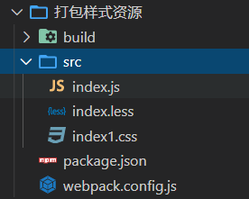

<div align='center' ><font size='70'>打包样式资源</font></div>

------

**目录结构**




1. 新建一个目录 新建一个src文件夹，并在其中指定入口文件 index.js  新建index.css  , 将 index.css 文件导入到 index.js 文件中。

```javascript
// index.js
// 引入样式文件
import './index1.css';
import './index.less';
```

2. 初始化项目及安装webpack-cli等不详细写,看上一篇。但是打包样式文件需要安装 css-loader 和 style-loader

```
命令  cnpm i  css-loader  style-loader -D
```

3. 在当前文件夹根目录下，新建 webpack.config.js 文件， 这个文件是webpack 的配置文件。

```javascript
/**
 * webpack.config.js 配置文件
 * 作用： 指示webpack做什么操作
 *
 * 所有的构建工具都是基于node 去运行的，都用的是commonJS
 *
 * loader ： 1. 下载依赖  2. 使用 （直接在配置中添加）
 * */
// 从 path 中解构一个处理 绝对路径的方法 resolve
const { resolve }  = require("path");

module.exports = {
    // 入口起点
    entry:'./src/index.js',
    // 出口终点
    output: {
        // 输出文件名
        filename:'built.js',
        // 输出路径 采用绝对路径    __dirname 是nodejs的变量，代表当前文件目录的绝对路径
        path:resolve(__dirname , 'build')
    },
    // loader 配置写在 module 中
    module:{
        // rules 中写详细的loader配置
        rules:[
            {
                // 匹配哪些文件
                test:/\.css$/ ,
                // 使用哪些loader进行处理
                use: [  // 先执行 css-loader 将 样式资源变成 js字符串， 然后执行 style-loader 创建style标签，插入到head
                    "style-loader", // 创建style标签，将js中的样式资源插入，添加到head中生效
                    "css-loader"  // 将css 文件 变成commonjs模块加载到js 中，里面的内容是样式字符串
                ]
            },
            {
                test:/\.less$/,
                // 注意这里需要下载 less 和 less-loader 才能完成打包命令
                use:[
                    'style-loader',
                    'css-loader',
                    'less-loader'
                ]
            },
        ]
    },
    // plugins的配置
    plugins:[
        //详细的plugins配置
    ],
    // mode 模式
    mode: "development"
}
```

4. 项目运行

```
直接运行： webpack , 就会打包css 文件。
```

**如果我们需要打包 .less 或者 .scss文件**

1. 修改配置
```javascript
// 修改 loader 的配置信息 rules
 rules:[
                {
                    test:/\.less$/,
                    use:[
                        'style-loader',
                        'css-loader',
                        'less-loader'
                    ]
                }
            ]

```
2. 安装依赖

```
下载 less-loader 命令 ： cnpm i  less  less-loader -D
或者 scss-loader 命令 ： cnpm i  scss  scss-loader -D
注意： 如果只是安装 less-loader 会报错 ：Cannot find module 'less'
```

